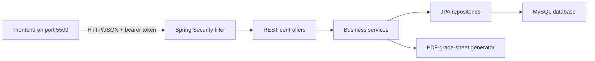

# University Course Enrollment and Academic Management System

## 1. Project Summary

The University Course Enrollment and Academic Management System is a role-based academic portal for maintaining students, faculty, courses, enrollments, grades, and transcripts. The backend is implemented with Java 21, Spring Boot, Spring MVC, Spring Security, Spring Data JPA, and Hibernate.

The system follows a layered MVC-oriented architecture and exposes REST APIs for a separately hosted HTML, CSS, and vanilla JavaScript frontend.

### Main objectives

- Centralize student and faculty information.
- Maintain a semester-based course catalogue.
- Allow students to enroll in and drop courses.
- Enforce course seat limits.
- Allow faculty members to submit and update grades.
- Synchronize submitted grades with academic records.
- Calculate GPA and generate downloadable PDF grade sheets.
- Restrict functionality according to user role.

## 2. Scope

The project implements the following academic modules:

1. Student registration and profile management
2. Course catalogue and semester offering management
3. Course enrollment and drop/add management
4. Faculty grading and assessment management
5. Academic records and transcript generation

The Registrar role described in the original requirement document is intentionally omitted. Registrar responsibilities are handled by the Administrator role.

The system does not include payment processing, examinations, attendance, external identity providers, or complex prerequisite rules.

## 3. Technology Stack

| Area | Technology |
|---|---|
| Backend language | Java 21 |
| Application framework | Spring Boot 4.1 |
| Web framework | Spring MVC |
| Security | Spring Security and bearer tokens |
| Persistence | Spring Data JPA and Hibernate |
| Database | MySQL 8.x |
| Validation | Jakarta Bean Validation |
| Backend build | Maven Wrapper |
| Frontend integration | REST API and CORS |
| Frontend technology | HTML, CSS, vanilla JavaScript |
| Automated testing | JUnit 5, Mockito, Spring MockMvc |

## 4. System Architecture



### Backend layers

- **Controllers** receive requests, validate payloads, and return HTTP responses.
- **Services** contain business rules and coordinate related operations.
- **Repositories** provide database access through Spring Data JPA.
- **Entities** define the persistent academic data model.
- **Security components** authenticate bearer tokens and enforce role access.
- **Configuration components** configure security, CORS, initialization, and database behavior.

## 5. User Roles

### Administrator

- Create student accounts and initial passwords.
- Create faculty accounts and initial passwords.
- Add, update, and remove courses.
- Remove students and faculty members.
- View users and dashboard statistics.
- Change a user's assigned role.
- Access transcripts.

### Faculty

- View courses, students, enrollments, and grades.
- Submit and update student grades.
- Download student grade sheets in PDF format.

### Student

- View and update a student profile.
- View the course catalogue.
- Enroll in courses with available seats.
- Drop active enrollments.
- View grades.
- Download a personal grade sheet in PDF format.

## 6. Authentication and Authorization

Authentication uses a username or email together with a password.

1. The client sends credentials to `POST /api/auth/login`.
2. Passwords are compared against BCrypt hashes in the database.
3. The backend creates a random bearer token with a 12-hour lifetime.
4. The frontend sends the token in the `Authorization: Bearer <token>` header.
5. `BearerTokenFilter` validates the token before protected API requests.
6. Spring Security checks the authenticated user's role.
7. Logout revokes the token through `POST /api/auth/logout`.

Tokens are stored in backend memory and are invalidated when the backend restarts.

## 7. Functional Modules

### 7.1 Student management

Student records contain:

- Student ID
- Full name
- Email
- Department
- Contact number
- Enrollment year

Administrators create student accounts. The system generates usernames in the format `S001`, `S002`, and so on. Passwords are BCrypt-hashed before storage and are never returned by directory APIs.

### 7.2 Faculty management

Faculty records contain:

- Faculty ID
- Full name
- Email
- Department
- Designation
- Contact number

Administrators create faculty accounts and select the initial password. Faculty usernames use the format `F001`, `F002`, and so on.

### 7.3 Course management

Course records contain:

- Course ID and unique course code
- Course name
- Credits
- Department
- Semester offered
- Available seat capacity
- Total semesters
- Program duration in years

Only administrators can create, modify, or remove courses.

### 7.4 Enrollment management

An enrollment links a student and course and has one of these states:

- `ENROLLED`
- `DROPPED`

Before creating or restoring an enrollment, the service verifies that:

- The student exists.
- The course exists.
- The number of active enrollments is below the course seat limit.

### 7.5 Grade management

Faculty can submit or update these grade values:

- `A+`, `A`, `A-`
- `B+`, `B`, `B-`
- `C+`, `C`, `C-`
- `D`, `F`
- `PASS`, `FAIL`

Every grade submission updates the corresponding academic record with the student, course, grade, and semester.

### 7.6 Transcript and grade-sheet generation

Transcript generation retrieves the student's academic records and course information. It produces:

- Student identification and department
- Enrollment year
- Completed-course count
- Course codes and names
- Semester information
- Grades
- Credit-weighted GPA
- Generation date

The PDF response uses the `application/pdf` content type and an attachment filename such as `student-5-grade-sheet.pdf`.

## 8. Database Model

### User

Stores authentication and role information. A user may be linked one-to-one with a student or faculty record.

Key fields: `userId`, `username`, `email`, `password`, `role`, `fullName`, `student`, `faculty`.

### Student

Key fields: `studentId`, `name`, `email`, `department`, `contactNumber`, `enrollmentYear`.

### Faculty

Key fields: `facultyId`, `name`, `email`, `department`, `designation`, `contactNumber`.

### Course

Key fields: `courseId`, `courseCode`, `courseName`, `credits`, `department`, `semesterOffered`, `seats`, `totalSemesters`, `durationYears`.

### Enrollment

Key fields: `enrollmentId`, `studentId`, `courseId`, `enrollmentStatus`.

The student/course combination is unique.

### Grade

Key fields: `gradeId`, `studentId`, `courseId`, `grade`, `remarks`.

### AcademicRecord

Key fields: `recordId`, `studentId`, `courseId`, `grade`, `semester`.

## 9. REST API Reference

The backend base URL is `http://localhost:8082/api`.

### Authentication

| Method | Endpoint | Access | Purpose |
|---|---|---|---|
| POST | `/auth/login` | Public | Authenticate and return a bearer token |
| POST | `/auth/logout` | Authenticated | Revoke the current token |

### Administration

| Method | Endpoint | Access | Purpose |
|---|---|---|---|
| GET | `/admin/users` | Admin | List user accounts |
| PUT | `/admin/users/{id}/role` | Admin | Update a user role |
| GET | `/admin/stats` | Admin | Return record totals |
| POST | `/students` | Admin | Create a student and login account through `StudentService` |

### Students

| Method | Endpoint | Purpose |
|---|---|---|
| GET | `/students` | List or search students |
| GET | `/students/{id}` | Return one student |
| PUT | `/students/{id}` | Update a student profile |
| DELETE | `/students/{id}` | Delete a student and related records |

### Faculty

| Method | Endpoint | Purpose |
|---|---|---|
| GET | `/faculty` | List faculty members |
| GET | `/faculty/{id}` | Return one faculty member |
| POST | `/faculty` | Create faculty and login account |
| DELETE | `/faculty/{id}` | Delete faculty and linked account |

### Courses

| Method | Endpoint | Purpose |
|---|---|---|
| GET | `/courses` | List courses |
| GET | `/courses/{id}` | Return course details |
| GET | `/courses/semester/{semester}` | List courses offered in a semester |
| POST | `/courses` | Create a course |
| PUT | `/courses/{id}` | Update a course |
| DELETE | `/courses/{id}` | Delete a course and related records |

### Enrollments

| Method | Endpoint | Purpose |
|---|---|---|
| GET | `/enrollments` | List enrollments, optionally filtered by student or course |
| POST | `/enrollments` | Enroll a student in a course |
| PUT | `/enrollments/{id}/drop` | Mark an enrollment as dropped |
| DELETE | `/enrollments/{id}` | Permanently remove an enrollment |

### Grades

| Method | Endpoint | Purpose |
|---|---|---|
| GET | `/grades` | List grades |
| GET | `/grades/course/{courseId}` | List course grades |
| GET | `/grades/student/{studentId}` | List student grades |
| POST | `/grades` | Submit a grade |
| PUT | `/grades/{gradeId}` | Update a grade |

### Transcripts

| Method | Endpoint | Purpose |
|---|---|---|
| GET | `/transcripts/{studentId}/raw` | Return academic records |
| GET | `/transcripts/{studentId}/summary` | Return transcript summary and GPA |
| GET | `/transcripts/{studentId}/pdf` | Download the PDF grade sheet |

## 10. Validation Rules

- Names must contain 2–80 characters.
- Emails must use a valid email format and be unique where required.
- Account passwords must contain 6–72 characters.
- Contact numbers accept 7–20 digits and common phone symbols.
- Enrollment years must be between 2000 and 2100.
- Course credits, seats, semesters, and duration must be positive.
- Course codes and emails must be unique.
- Grades must match the accepted grade list.
- Required values are validated by both the frontend and backend.

Invalid input returns HTTP `400`. Missing resources return HTTP `404`. Invalid login credentials return HTTP `401`, and insufficient role permissions return HTTP `403`.

## 11. Local Configuration

### Requirements

- JDK 21
- IntelliJ IDEA or another Java IDE
- Maven Wrapper included with the project
- MySQL Server 8.x and MySQL Workbench
- A separately served frontend on port 5500

### MySQL Workbench startup

Start the local MySQL server from MySQL Workbench and create the schema:

```sql
CREATE DATABASE IF NOT EXISTS university_db;
```

The default connection uses `root` / `root`. If the Workbench connection has different credentials, set them before starting the application:

```powershell
$env:DB_URL="jdbc:mysql://localhost:3306/university_db"
$env:DB_USERNAME="root"
$env:DB_PASSWORD="your-password"
.\mvnw.cmd spring-boot:run
```

The backend starts on `http://localhost:8082` and Hibernate creates or updates the tables in MySQL.

### Frontend connection

The backend permits browser API requests from:

- `http://localhost:5500`
- `http://127.0.0.1:5500`

## 12. Default Development Accounts

| Role | Username | Password |
|---|---|---|
| Administrator | `admin` | `admin123` |
| Faculty | `faculty` | `faculty123` |
| Student | `student` | `student123` |

These accounts are intended only for local development and demonstrations.

## 13. Testing

Run all backend tests with:

```powershell
.\mvnw.cmd test
```

The current suite contains nine tests across:

- Spring application-context startup
- Complete cross-role API workflow
- Authentication and authorization behavior
- Request validation
- Administrator-created student accounts
- Administrator-selected faculty passwords
- Duplicate-email rejection
- Enrollment seat-limit enforcement
- Academic-record synchronization and PDF generation

## 14. Requirements Traceability

| Requirement from project specification | Implementation |
|---|---|
| Student registration and profiles | Admin student creation, student profile APIs |
| Course catalogue and semester offerings | Course CRUD and semester endpoint |
| Enrollment and drop/add | Enrollment APIs and seat-limit rule |
| Faculty grading | Grade submission and update APIs |
| Academic records | Grade-to-academic-record synchronization |
| Transcript generation | Summary, GPA, raw records, PDF grade sheet |
| Hibernate ORM | Spring Data JPA entities and repositories |
| MySQL persistence | Default datasource in `application.properties` |
| MVC structure | Controller, service, repository, and model layers |

## 15. Known Limitations

- Bearer-token sessions are held in memory and do not survive restarts.
- Tokens are not shared between multiple backend instances.
- Record ownership checks should be strengthened for production use.
- Course prerequisites and maximum student credit limits are not implemented.
- The generated grade-sheet PDF is intended for compact academic records.
- Default accounts are intended for local development only.
- Database changes use Hibernate `ddl-auto=update`; production systems should use versioned migrations.

## 16. Recommended Future Improvements

- Replace in-memory tokens with signed JWTs or persistent sessions.
- Add record-level authorization for student-owned information.
- Add course-to-faculty assignments.
- Add prerequisite and maximum-credit rules.
- Add pagination and filtering for large directories.
- Add Flyway or Liquibase database migrations.
- Add password reset and administrator-driven account recovery.
- Add multi-page styled transcript templates and university signatures.
- Add frontend browser automation tests.
- Disable development accounts in production profiles.
